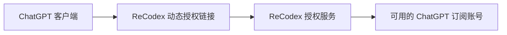
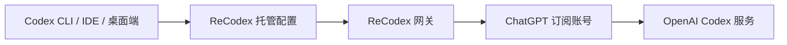

# 工作原理

ReCodex 为 ChatGPT 客户端和 Codex 提供两条不同的接入流程：ChatGPT 使用动态授权链接，Codex 使用本机设备登录与托管配置。

## ChatGPT 客户端授权

授权链接只用于当前登录流程。ReCodex 根据你的账户、套餐和设备状态生成入口；客户端完成授权后即可使用。授权失效时重新生成，不需要在文档中固定或收藏某个授权地址。

## Codex 托管配置

`recodex login` 使用浏览器设备流程批准当前机器。成功后，ReCodex 写入 Codex 可识别的托管配置；退出时会尝试撤销设备并恢复登录前的配置。

## 一次请求会发生什么

1. 客户端发起请求。
2. ReCodex 验证当前设备与订阅状态。
3. 服务选择与会话匹配的可用订阅账号。
4. 请求发送到对应的 OpenAI 服务，响应沿原路径返回。

## 你不用关心的事

- 手动保存上游账号密码。
- 为 Codex 拼接 `base_url` 或复制 API Key。
- 在多个 Codex 入口分别维护配置。
- 把原始诊断信息交给客服。

## 我们记录什么

为提供用量、故障定位和安全审计，服务可能记录请求时间、状态、模型、Token 计数、设备标识与稳定错误分类。ReCodex 不会在公开文档中暴露上游账号凭据。

<Note>
  详细数据处理和保留规则以 ReCodex 账户中的最新服务条款与隐私说明为准。
</Note>