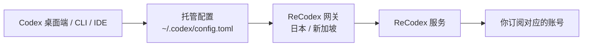

# 工作原理

ReCodex 不替换官方 Codex,而是**在它之上工作**:接管账号与额度,并把请求经由就近网关送到你订阅对应的账号。

## 整体链路



## 登录时发生了什么

`recodex login`(或桌面端面板里的登录)走的是**设备码流程**:

1. 客户端向服务端申请一个授权码。
2. 你在浏览器里登录 ReCodex 并批准这台设备 —— 批准这一步只能由你本人完成。
3. 服务端签发这台设备的令牌,客户端把它存进系统密钥库(Windows 凭据管理器 / macOS 钥匙串)。
4. 客户端写入 Codex 能识别的**托管配置**,并把访问密钥写进用户环境变量。

托管配置是一段带标记的块,只动这一块,不碰你 `config.toml` 里的其它内容:

```toml
# >>> recodex managed block, do not edit >>>
model_provider = "recodex"

[model_providers.recodex]
name = "ReCodex"
base_url = "https://<网关>/backend-api/codex"
wire_api = "responses"
env_key = "RECODEX_KEY"
# <<< recodex managed block <<<
```

## 网关

服务端会给出多个可用网关(日本、新加坡,各有直连与 CDN 两种入口)。客户端可以实测延迟并选最快的一个:

```bash
recodex gateways        # 看延迟和当前选中的
recodex gateways auto   # 自动选最快的
recodex gateways use jp # 手动指定
```

桌面端面板上的「用最快网关」是同一个动作。

## 额度

额度是**服务端权威**的,桌面端面板和 `recodex usage` 读的是同一份数据,不会各说各话。

分两个窗口:

- **5 小时窗口**:短期用量。近 5 小时没有用量时上游不返回这个窗口,界面上就不显示。
- **7 天窗口**:常驻显示。

数据是快照,不是实时的。超过 5 分钟没更新时会标注「数据可能不是最新的」,同时客户端会在后台补一次刷新 —— 你也可以手动点「刷新额度」立刻更新。

## 官方模式

面板上可以一键切回**你自己的 ChatGPT 账号**:切过去之后新对话走官方账号,ReCodex 的托管配置暂存起来,切回来时原样恢复,不用重新登录。

<Note>
  切到官方模式时,ReCodex 的 provider **定义**会保留在配置里(只是不再作为默认)。 这是有意的:Codex 把每个会话当时用的 provider 记在会话文件里,定义删掉的话, 之前用 ReCodex 建的**历史对话就打不开了**。保留定义,历史对话才能继续。
</Note>

## 一次请求会发生什么

1. Codex 按托管配置把请求发到你选中的 ReCodex 网关。
2. 网关校验设备令牌与订阅状态。
3. 服务端把请求转给你订阅绑定的账号。
4. 响应沿原路返回,同时记录这次的用量。

## 你不用关心的事

- 手动保存上游账号密码。
- 为 Codex 拼 `base_url` 或复制 API Key。
- 在 CLI、IDE、桌面端分别维护配置 —— 它们读的是同一份 `~/.codex` 配置。

## 我们记录什么

为提供用量统计、故障定位和安全审计,服务会记录请求时间、状态、模型、Token 计数、设备标识与错误分类。

客户端本地的诊断日志(`recodex logs`)是**脱敏**的:只有命令名、结果、版本和系统,不含密钥。

<Note>
  详细的数据处理与保留规则,以 ReCodex 账户中的最新服务条款与隐私说明为准。
</Note>