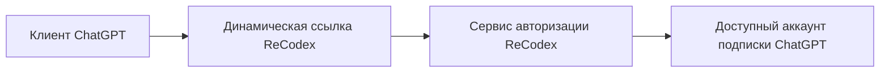
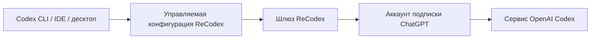

# Как это работает

ReCodex предоставляет два разных потока подключения: ChatGPT использует динамические ссылки авторизации, Codex — локальный вход устройства и управляемую конфигурацию.

## Авторизация клиента ChatGPT

Ссылка авторизации действует только для текущего входа. ReCodex генерирует точку входа на основе вашего аккаунта, тарифа и состояния устройств. Когда ссылка истекает, просто сгенерируйте новую — не сохраняйте старые адреса в закладках.

## Управляемая конфигурация Codex

`recodex login` подтверждает текущую машину через браузерный device flow. После успеха ReCodex записывает конфигурацию, понятную Codex; при выходе он отзывает устройство и восстанавливает прежнюю конфигурацию.

## Что происходит при запросе

1. Клиент отправляет запрос.
2. ReCodex проверяет текущее устройство и статус подписки.
3. Сервис выбирает подходящий доступный аккаунт подписки для сеанса.
4. Запрос уходит в соответствующий сервис OpenAI, ответ возвращается тем же путём.

## О чём вам не нужно думать

- Хранение паролей от вышестоящих аккаунтов.
- Ручная настройка `base_url` или копирование API-ключей для Codex.
- Отдельная конфигурация для каждой точки входа Codex.
- Передача сырых диагностических данных в поддержку.

## Что мы записываем

Для учёта расхода, диагностики и аудита безопасности сервис может записывать время запроса, статус, модель, число токенов, идентификатор устройства и стабильную категорию ошибки. ReCodex не раскрывает учётные данные вышестоящих аккаунтов в публичной документации.

<Note>
  Точные правила обработки и хранения данных определяются актуальными условиями сервиса и политикой конфиденциальности в вашем аккаунте ReCodex.
</Note>