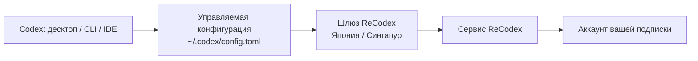

# Как это работает

ReCodex не заменяет официальный Codex, а **работает поверх него**: берёт на себя аккаунт и квоту и отправляет запросы через ближайший шлюз на аккаунт, соответствующий вашей подписке.

## Общая схема



## Что происходит при входе

`recodex login` (и вход в панели десктопного клиента) — это **поток авторизации устройства**:

1. Клиент запрашивает у сервера код авторизации.
2. Вы входите в ReCodex в браузере и подтверждаете это устройство — этот шаг можете сделать только вы сами.
3. Сервер выдаёт токен для устройства; клиент кладёт его в системное хранилище ключей (Диспетчер учётных данных Windows / Связка ключей macOS).
4. Клиент записывает **управляемую конфигурацию**, понятную Codex, и кладёт ключ доступа в переменную окружения пользователя.

Управляемая конфигурация — это блок с маркерами. Трогается только он, остальное в вашем `config.toml` не меняется:

```toml
# >>> recodex managed block, do not edit >>>
model_provider = "recodex"

[model_providers.recodex]
name = "ReCodex"
base_url = "https://<шлюз>/backend-api/codex"
wire_api = "responses"
env_key = "RECODEX_KEY"
# <<< recodex managed block <<<
```

## Шлюзы

Сервер отдаёт несколько доступных шлюзов (Япония и Сингапур, у каждого прямой вход и через CDN). Клиент умеет замерить задержку и выбрать самый быстрый:

```bash
recodex gateways        # задержки и текущий выбор
recodex gateways auto   # выбрать самый быстрый
recodex gateways use jp # выбрать вручную
```

Кнопка «Самый быстрый шлюз» в панели делает то же самое.

## Квота

Квота — **авторитетная серверная**: панель и `recodex usage` читают одни и те же данные и не могут разойтись.

Два окна:

- **Окно 5 часов**: краткосрочный расход. Если за последние 5 часов расхода не было, апстрим не возвращает это окно — и в интерфейсе его нет.
- **Окно 7 дней**: показывается всегда.

Данные — снимок, а не реальное время. Если им больше 5 минут, появляется пометка «данные могут быть неактуальны», и клиент делает фоновое обновление. Можно обновить и вручную.

## Официальный режим

В панели можно одним нажатием вернуться на **свой аккаунт ChatGPT**: новые диалоги пойдут через него, конфигурация ReCodex сохранится и вернётся как была — без повторного входа.

<Note>
  При переходе в официальный режим **определение** провайдера ReCodex остаётся в конфигурации (просто перестаёт быть значением по умолчанию). Это сделано намеренно: Codex записывает использованного провайдера в файл сессии — если удалить определение, **старые диалоги перестанут открываться**. С сохранённым определением история продолжает работать.
</Note>

## Что происходит с одним запросом

1. Codex отправляет запрос на выбранный шлюз ReCodex согласно управляемой конфигурации.
2. Шлюз проверяет токен устройства и статус подписки.
3. Сервер направляет запрос на аккаунт, привязанный к вашей подписке.
4. Ответ возвращается тем же путём, расход записывается.

## О чём можно не думать

- Хранить пароли апстрим-аккаунтов.
- Собирать `base_url` для Codex или копировать API-ключи.
- Поддерживать конфигурацию отдельно в CLI, IDE и десктопе — все они читают один и тот же `~/.codex`.

## Что мы записываем

Для статистики расхода, диагностики и аудита безопасности сервис записывает время и статус запроса, модель, счётчики токенов, идентификатор устройства и классификацию ошибок.

Локальный диагностический журнал клиента (`recodex logs`) **обезличен**: только имя команды, результат, версия и ОС — без ключей.

<Note>
  Подробные правила обработки и хранения данных — в актуальных условиях обслуживания и политике конфиденциальности в вашем аккаунте ReCodex.
</Note>