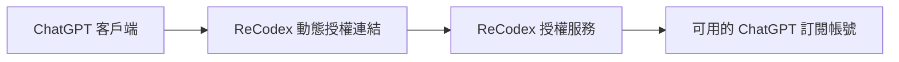
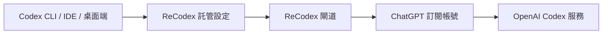

# 運作原理

ReCodex 為 ChatGPT 客戶端和 Codex 提供兩條不同的接入流程：ChatGPT 使用動態授權連結，Codex 使用本機裝置登入與託管設定。

## ChatGPT 客戶端授權

授權連結只用於目前的登入流程。ReCodex 根據你的帳戶、方案和裝置狀態產生入口；客戶端完成授權後即可使用。授權失效時重新產生，不需要在文件中固定或收藏某個授權網址。

## Codex 託管設定

`recodex login` 使用瀏覽器裝置流程批准目前的機器。成功後，ReCodex 寫入 Codex 可識別的託管設定；登出時會嘗試撤銷裝置並恢復登入前的設定。

## 一次請求會發生什麼

1. 客戶端發起請求。
2. ReCodex 驗證目前裝置與訂閱狀態。
3. 服務選擇與工作階段相符的可用訂閱帳號。
4. 請求傳送到對應的 OpenAI 服務，回應沿原路徑返回。

## 你不用關心的事

- 手動保存上游帳號密碼。
- 為 Codex 拼接 `base_url` 或複製 API Key。
- 在多個 Codex 入口分別維護設定。
- 把原始診斷資訊交給客服。

## 我們記錄什麼

為提供用量、故障定位和安全審計，服務可能記錄請求時間、狀態、模型、Token 計數、裝置識別碼與穩定錯誤分類。ReCodex 不會在公開文件中暴露上游帳號憑證。

<Note>
  詳細資料處理和保留規則以 ReCodex 帳戶中的最新服務條款與隱私說明為準。
</Note>