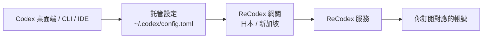

# 運作原理

ReCodex 不替換官方 Codex,而是**在它之上工作**:接管帳號與額度,並把請求經由就近網關送到你訂閱對應的帳號。

## 整體鏈路



## 登入時發生了什麼

`recodex login`(或桌面端面板裡的登入)走的是**裝置碼流程**:

1. 客戶端向伺服器申請一個授權碼。
2. 你在瀏覽器裡登入 ReCodex 並批准這台裝置 —— 批准這一步只能由你本人完成。
3. 伺服器簽發這台裝置的權杖,客戶端把它存進系統金鑰庫(Windows 憑據管理員 / macOS 鑰匙圈)。
4. 客戶端寫入 Codex 能辨識的**託管設定**,並把存取金鑰寫進使用者環境變數。

託管設定是一段帶標記的區塊,只動這一塊,不碰你 `config.toml` 裡的其它內容:

```toml
# >>> recodex managed block, do not edit >>>
model_provider = "recodex"

[model_providers.recodex]
name = "ReCodex"
base_url = "https://<網關>/backend-api/codex"
wire_api = "responses"
env_key = "RECODEX_KEY"
# <<< recodex managed block <<<
```

## 網關

伺服器會給出多個可用網關(日本、新加坡,各有直連與 CDN 兩種入口)。客戶端可以實測延遲並選最快的一個:

```bash
recodex gateways        # 看延遲和目前選中的
recodex gateways auto   # 自動選最快的
recodex gateways use jp # 手動指定
```

桌面端面板上的「用最快網關」是同一個動作。

## 額度

額度是**伺服器權威**的,桌面端面板和 `recodex usage` 讀的是同一份資料,不會各說各話。

分兩個視窗:

- **5 小時視窗**:短期用量。近 5 小時沒有用量時上游不返回這個視窗,介面上就不顯示。
- **7 天視窗**:常駐顯示。

資料是快照,不是即時的。超過 5 分鐘沒更新時會標註「資料可能不是最新的」,同時客戶端會在背景補一次重新整理 —— 你也可以手動點「重新整理額度」立刻更新。

## 官方模式

面板上可以一鍵切回**你自己的 ChatGPT 帳號**:切過去之後新對話走官方帳號,ReCodex 的託管設定暫存起來,切回來時原樣恢復,不用重新登入。

<Note>
  切到官方模式時,ReCodex 的 provider **定義**會保留在設定裡(只是不再作為預設)。 這是有意的:Codex 把每個工作階段當時用的 provider 記在工作階段檔案裡,定義刪掉的話, 之前用 ReCodex 建的**歷史對話就打不開了**。保留定義,歷史對話才能繼續。
</Note>

## 一次請求會發生什麼

1. Codex 按託管設定把請求發到你選中的 ReCodex 網關。
2. 網關校驗裝置權杖與訂閱狀態。
3. 伺服器把請求轉給你訂閱綁定的帳號。
4. 回應沿原路返回,同時記錄這次的用量。

## 你不用關心的事

- 手動保存上游帳號密碼。
- 為 Codex 拼 `base_url` 或複製 API Key。
- 在 CLI、IDE、桌面端分別維護設定 —— 它們讀的是同一份 `~/.codex` 設定。

## 我們記錄什麼

為提供用量統計、故障定位和安全稽核,服務會記錄請求時間、狀態、模型、Token 計數、裝置識別與錯誤分類。

客戶端本機的診斷日誌(`recodex logs`)是**脫敏**的:只有命令名、結果、版本和系統,不含金鑰。

<Note>
  詳細的資料處理與保留規則,以 ReCodex 帳戶中的最新服務條款與隱私說明為準。
</Note>